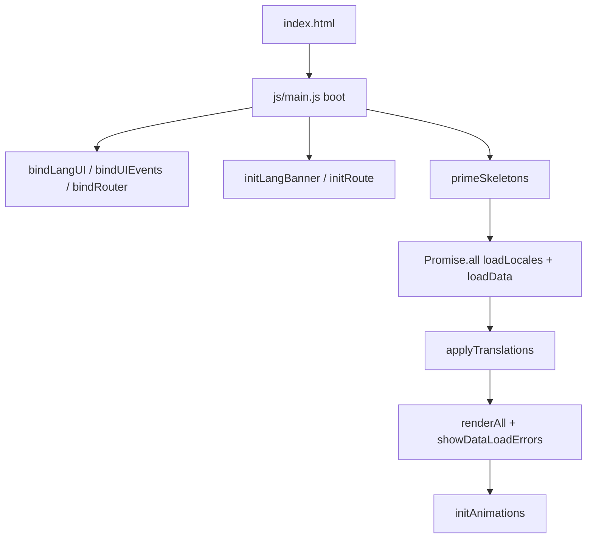
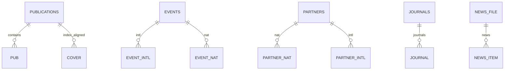
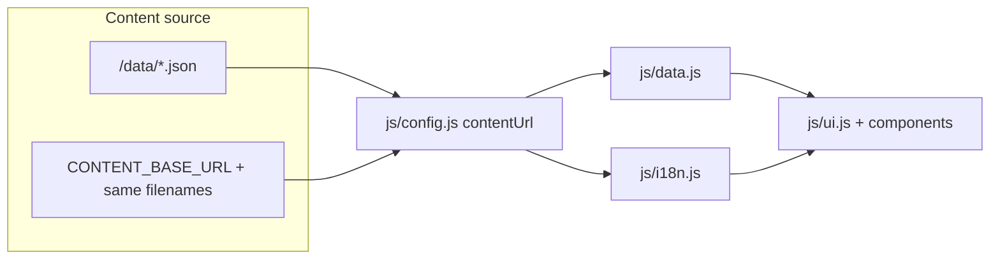

# CRSIC 2026 — Official Public Website

Living single source of truth for the public site of **مركز البحث في العلوم الإسلامية والحضارة** (Center for Research in Islamic Sciences and Civilization — CRSIC), Laghouat, Algeria.

| Related docs | Role |
|--------------|------|
| [docs/README.md](./docs/README.md) | Documentation index |
| [docs/WORKLOG.md](./docs/WORKLOG.md) | Changelog and status snapshot |
| [docs/qa/SMOKE.md](./docs/qa/SMOKE.md) | Pre-merge smoke checklist (~5 minutes) |
| [docs/audits/AUDIT.md](./docs/audits/AUDIT.md) | Closed architecture audit (P0–P3) |
| [docs/audits/UIUX.md](./docs/audits/UIUX.md) | UI/UX audit log |
| [docs/audits/PARITY.md](./docs/audits/PARITY.md) | AR/EN parity matrix (partial) |
| [docs/prds/](./docs/prds/) | Product requirement documents (future) |
| [data/README.md](./data/README.md) | Content-editor guide for JSON / locales |
| [data/CMS.md](./data/CMS.md) | Remote JSON publish contract (`CONTENT_BASE_URL`) |

---

## 1. Project overview & purpose

This repository is the **official public website** for CRSIC, a public scientific and technological research centre under Algeria’s Ministry of Higher Education and Scientific Research. The centre was founded by executive decree **15-136** (23 May 2015) and opened in January 2016. The site presents the institution, research departments, publications, journals, events, partnerships, news, and contact channels to researchers, partners, and the general public.

The product is a **zero-dependency static SPA**: Arabic-first (RTL) with English UI chrome, hash-based client routing, and content loaded from UTF-8 JSON files. There is no application backend, database, or package manager today.

| Link                                    | URL / location                                                                                                                |
| --------------------------------------- | ----------------------------------------------------------------------------------------------------------------------------- |
| Canonical organisation URL (schema.org) | [https://crsic.dz](https://crsic.dz)                                                                                          |
| Open Journal Systems                    | [https://crsic.dz/ojsre/](https://crsic.dz/ojsre/)                                                                            |
| Digital library (OPAC)                  | [https://www.crsic.dz/bib/opac_css/](https://www.crsic.dz/bib/opac_css/)                                                      |
| Webmail                                 | [https://www.crsic.dz:2096/](https://www.crsic.dz:2096/)                                                                      |
| Design / Figma / brand kit              | **Not in this repo.** Brand lives in CSS variables (`css/style.css`), logos under `img/`, and Google Fonts (Amiri + Tajawal). |

---

## 2. Technology stack

| Layer                        | Choice                                                           | Notes                                                   |
| ---------------------------- | ---------------------------------------------------------------- | ------------------------------------------------------- |
| Languages                    | HTML5, CSS3, JavaScript (ES modules)                             | No TypeScript                                           |
| Package manager / runtime    | **None**                                                         | No `package.json`, no lockfile, no Node build           |
| Front-end framework          | **None (vanilla)**                                               | Custom SPA                                              |
| State management             | Module-scoped vars + `localStorage`                              | Language + banner dismiss                               |
| Back-end / API / ORM         | **None**                                                         | Contact uses `mailto:`                                  |
| Database / cache / search    | **None**                                                         | Static JSON on disk or CDN                              |
| Fonts                        | Google Fonts: **Amiri** (400/700), **Tajawal** (300/400/500/700) | CDN in `index.html`                                     |
| Routing                      | Custom hash router                                               | `js/router.js` — `#home`, `#about`, …                   |
| i18n                         | Custom AR/EN dictionaries                                        | `data/locales/*.json`                                   |
| Hosting targets              | Static hosts                                                     | Vercel / Netlify / Apache configs included              |
| CI/CD                        | **None**                                                         | No GitHub Actions or similar                            |
| Auth / payments / email SaaS | **None**                                                         | Form opens the user’s mail client to `contact@crsic.dz` |
| Monitoring                   | **None**                                                         | —                                                       |
| Linters / formatters         | **None**                                                         | No ESLint, Prettier, or EditorConfig                    |
| Unit tests                   | Node built-in (`node --test`)                                    | `tests/*.test.mjs` (a11y Escape stack + `?lang=`); no CI |
| Bundler                      | **None**                                                         | Browser loads ES modules directly                       |
| IDE helper                   | VS Code Live Server                                              | Port **5501** (`.vscode/settings.json`)                 |

**App config (not** `.env`**):** `CONTENT_BASE_URL` in `js/config.js` — empty string = local `/data`.

---

## 3. Project structure

Annotated tree of the important layout (binary assets under `img/` summarised):

```text
CRSIC 2026/
├── .gitignore                 # OS / IDE / secrets / optional Node ignores
├── index.html                 # Single HTML shell: all page sections, nav, footer, schema.org
├── css/
│   └── style.css              # Design system, layout, animations (CSS variables in :root)
├── js/
│   ├── main.js                # ENTRY POINT — boot order, wires modules
│   ├── config.js              # CONTENT_BASE_URL + contentUrl()
│   ├── data.js                # fetch JSON, soft-fail, sync getters
│   ├── i18n.js                # locales, RTL/LTR, localStorage, banner
│   ├── router.js              # hash navigation, PAGE_PARENT, deep links
│   ├── ui.js                  # render, filters, lightbox, contact form, drawer
│   ├── a11y.js                # focus trap, Escape topmost dialog
│   ├── animations.js          # scroll/tilt/counters; respects prefers-reduced-motion
│   ├── utils.js               # DOM helpers, sanitizers, throttle/debounce
│   └── components/            # Safe DOM card builders (no string innerHTML)
│       ├── pubCard.js
│       ├── eventCard.js
│       ├── newsCard.js
│       ├── journalCard.js
│       └── partnerCard.js
├── data/                      # Runtime content (edit without touching JS)
│   ├── README.md              # Editor guide
│   ├── CMS.md                 # CDN / remote JSON publish contract
│   ├── publications.json
│   ├── events.json
│   ├── partners.json
│   ├── journals.json
│   ├── news.json
│   └── locales/
│       ├── ar.json            # Arabic UI chrome (~235 keys)
│       └── en.json            # English UI chrome (same keys)
├── img/
│   ├── crsic_logo.png         # Brand / OG image
│   ├── nav-crsic-logo.png     # Navbar logo
│   ├── crsic_flags.jpg        # Hero background (CSS)
│   ├── covers/                # Publication covers c00–c27, i00–i07
│   └── Holders/               # News photos 0.jpg–5.jpg
├── vercel.json                # Vercel 301s for legacy /about
├── _redirects                 # Netlify 301s
├── .htaccess                  # Apache 301s (NE preserves #)
├── README.md                  # This file (product SSOT)
├── docs/
│   ├── README.md              # Documentation index
│   ├── WORKLOG.md             # Living changelog
│   ├── qa/
│   │   └── SMOKE.md           # Pre-merge smoke checklist
│   ├── audits/
│   │   ├── AUDIT.md           # Closed audit
│   │   ├── UIUX.md            # UI/UX audit + fix log
│   │   └── PARITY.md          # AR/EN parity matrix
│   └── prds/
│       ├── README.md          # PRD folder guide
│       └── TEMPLATE.md        # Concise PRD template
├── tests/                     # Node built-in tests (`node --test`)
└── .vscode/
    └── settings.json          # Live Server port 5501
```

### Naming conventions

| Area               | Convention                                                             |
| ------------------ | ---------------------------------------------------------------------- |
| JS modules         | camelCase filenames matching responsibility (`data.js`, `pubCard.js`)  |
| Page sections      | `id="page-{id}"` matching hash (`#publications` → `page-publications`) |
| Nav / deep links   | `data-page`, optional `data-tab`, `data-filter`                        |
| i18n               | `data-i18n`, `data-i18n-html`, `data-i18n-placeholder`, `data-i18n-aria` |
| Home pub strip     | `#home-pub-grid` — grid ≥769px; scroll-snap carousel ≤768px             |
| Publication covers | `cNN` collective, `iNN` individual; index-aligned with `pubs[]`          |
| Content JSON       | UTF-8, no trailing commas, plain text in string fields (no HTML)         |

### Entry points & ignored / non-runtime folders

| Path                                      | Role                                                                       |
| ----------------------------------------- | -------------------------------------------------------------------------- |
| `index.html` → `js/main.js`               | Runtime entry                                                              |
| `.claude/`                                | Claude tool permissions only — **not part of the app**                     |
| No `node_modules/`, no `dist/`, no `.git` | Nothing generated by a build; Git is **not initialised** in this workspace |

### Boot sequence



---

## 4. Data architecture & current data state

There is **no relational database**, migrations framework, ORM, or seed runner. Content is static JSON fetched at runtime.

### 4.1 Content “schema” (JSON files)



#### `publications.json`

| Field         | Type           | Rules                                         |
| ------------- | -------------- | --------------------------------------------- | ---------- |
| `covers`      | `string[]`     | Paths like `img/covers/c00.jpg`               |
| `pubs`        | `object[]`     | **Must** keep `covers.length === pubs.length` |
| `pubs[].t`    | string         | Title                                         |
| `pubs[].type` | `"collective"` | `"individual"`                                | Filter key |
| `pubs[].dept` | string         | Department label (Arabic in current data)     |
| `pubs[].desc` | string         | Plain text only                               |

#### `events.json`

| Field | Type | Rules |
|-------|------|--------|
| `intl` / `nat` | `object[]` | International vs national |
| `day`, `month`, `year` | string | Display fragments (month often abbreviated Arabic) |
| `title`, `type` | string | Title and event kind label |
| `status` | `"done"` \| `"upcoming"` | Status badge |
| `img` | string (optional) | Home teaser photo; if omitted, Holders `0`–`5` cycle |

Home teaser `#home-events-grid` uses `getHomeEvents(3)` (intl + nat merged, newest first). Full events page still lists all items by year.

#### `partners.json`

| Field                              | Type       |
| ---------------------------------- | ---------- |
| `nat` / `intl`                     | `object[]` |
| `name`, `country`, `date`, `emoji` | strings    |

#### `journals.json`

| Field                                  | Type                                    |
| -------------------------------------- | --------------------------------------- |
| `journals[]`                           | objects                                 |
| `name`, `freq`, `langs`, `desc`, `url` | strings                                 |
| `bg`                                   | CSS gradient string for card background |

#### `news.json`

| Field            | Type                  |
| ---------------- | --------------------- |
| `news[]`         | objects               |
| `img`            | path string or `null` |
| `label`, `title` | strings               |

#### Locales

Flat maps `key → string` in `data/locales/ar.json` and `en.json`. Keys must stay in sync across both files.

### 4.2 Migrations & seed data

| Item                            | Status                                                                                         |
| ------------------------------- | ---------------------------------------------------------------------------------------------- |
| Migrations                      | **N/A** — edit JSON files directly                                                             |
| Seed scripts                    | **N/A**                                                                                        |
| Fixtures                        | The JSON files themselves are the fixtures                                                     |
| How to “seed” a new environment | Copy `/data` (and referenced `img/` paths) or point `CONTENT_BASE_URL` at a published snapshot |

See [data/README.md](./data/README.md) for add-publication / add-event recipes.

### 4.3 Current data description (as of README date)

Approximate inventory of shipped content:

| Resource           | Count / contents                                                                      |
| ------------------ | ------------------------------------------------------------------------------------- |
| Publications       | **36** (`covers` ↔ `pubs`); ~28 collective (`c00`–`c27`) + 8 individual (`i00`–`i07`) |
| Events             | **20** total across `intl` + `nat` (mostly `status: "done"`)                          |
| Partners           | **11** — 3 international + 8 national                                                 |
| Journals           | **4** — all link to `https://crsic.dz/ojsre/`                                         |
| News               | **9** items (6 with `img/Holders/*.jpg`, 3 with `img: null`)                          |
| Locale keys | **~262** per language (AR/EN key sets match) |
| Locale preference | `localStorage` `crsic_lang` + URL `?lang=ar\|en` |
| Admin accounts     | **None** — no auth                                                                    |
| Sample credentials | **None**                                                                              |

**Hard-coded in HTML (not JSON):** hero copy (via i18n keys), about / mission / vision / values, organisational chart, research department tabs (`r1`–`r4`) and team descriptions. Home publications, **events**, and news teasers are JSON-driven.

**Client-only persistence:**

| `localStorage` key       | Values | Purpose                             |
| ------------------------ | ------ | ----------------------------------- | ------------------- |
| `crsic_lang`             | `ar` \| `en` | Language preference (also mirrored as `?lang=`) |
| `crsic_banner_dismissed` | `1`    | English-suggestion banner dismissed |

### 4.4 DRY data models & client ↔ “server” flow



- **No DTOs or Zod/Yup schemas** — shape is conventional JSON; invalid JSON fails that resource only (soft-fail).
- Validation is informal: length mismatch `covers`/`pubs` logs a console warning; card builders assume documented fields.
- Rendering uses `createElement` / `textContent` and helpers in `js/utils.js` (`safeImageSrc`, `setTrustedBrHtml` for `<br>` only) to avoid XSS from content strings.
- Contact “API”: `handleContactForm` builds `mailto:contact@crsic.dz?subject=…&body=…` — no HTTP POST.

Remote publish contract (optional CDN / same JSON filenames): [data/CMS.md](./data/CMS.md). No external CMS — publishing will later be owned by an internal app (roadmap §10).

---

## 5. Organisation & collaboration rules

### 5.1 Git status

| Topic | Current state |
|-------|----------------|
| Repository | **On GitHub** — [hc-medamine/CRSIC-2026](https://github.com/hc-medamine/CRSIC-2026) |
| Remote | `origin` → `https://github.com/hc-medamine/CRSIC-2026.git` (`main` tracks `origin/main`) |
| Ignore rules | [`.gitignore`](./.gitignore) — OS junk, `.claude/`, secrets, optional `node_modules/` |
| Tracked IDE hint | `.vscode/settings.json` (Live Server port 5501) is tracked; other `.vscode/*` ignored |
| Changelog | [docs/WORKLOG.md](./docs/WORKLOG.md) — append new entries **at the top** |
| Release process | Manual static deploy of project root; bump content by editing JSON or switching `CONTENT_BASE_URL` |
| Coding standards | ES modules, named exports, JSDoc on public functions, no `innerHTML` assignment in `/js`, CSS variables for brand colours |
| Lint / format | **None** yet |
| PR template / issue board | **None** yet |
| Area ownership | `/data` (editors), `/js`+`/css` (developers), `/img` (media) |

**PATH note (Windows):** Git lives at `C:\Program Files\Git\cmd\git.exe`. If `git` is not recognised in a terminal, add that `cmd` folder to the user PATH, or call git via the full path.

### 5.2 Branching strategy

| Branch | Purpose |
|--------|---------|
| `main` | Stable public site — only merge reviewed, working work |
| `feature/<short-name>` | One change set (e.g. `feature/home-events-json`, `feature/ui-audit`) |
| `fix/<short-name>` | Bug fixes |
| `content/<short-name>` | JSON / locale / image-only updates (optional prefix) |
| `docs/<short-name>` | README / WORKLOG / audit doc-only updates (optional) |

Rules:

1. Start every non-trivial change from an up-to-date `main`.
2. One concern per branch — do not mix content dumps with UI refactors.
3. Prefer short-lived branches; merge (or rebase locally) then delete the branch.
4. Never force-push `main`.

```bash
git checkout main
git pull   # when a remote exists
git checkout -b feature/my-change
# … work …
git add -A
git status
git commit -m "feat: describe why"
# open PR / merge into main when ready
```

### 5.3 Commit message convention

Use [Conventional Commits](https://www.conventionalcommits.org/):

| Prefix | Use for |
|--------|---------|
| `feat:` | New user-facing behaviour |
| `fix:` | Bug fix |
| `content:` | `/data` JSON, locales, or media inventory |
| `style:` | CSS / visual-only (no behaviour change) |
| `refactor:` | Code restructure without behaviour change |
| `docs:` | README, `docs/*`, data guides |
| `chore:` | Gitignore, tooling, housekeeping |

Examples:

```text
docs: record git workflow in README and WORKLOG
fix: drive home events teaser from events.json
content: add July 2026 national seminar
style: smooth publication card hover on mobile
```

### 5.4 What to document after every completed change

| Done work | Update these files |
|-----------|-------------------|
| Architecture, routes, stack, setup, roadmap | [README.md](./README.md) |
| Chronological “what shipped” + status snapshot | [docs/WORKLOG.md](./docs/WORKLOG.md) (newest entry at top) |
| Content schema / editor recipes | [data/README.md](./data/README.md) |
| Remote JSON contract | [data/CMS.md](./data/CMS.md) |
| Historical audit closure only | [docs/audits/AUDIT.md](./docs/audits/AUDIT.md) (do not reopen casually) |
| New product slice / Step 4+ specs | [docs/prds/](./docs/prds/) from [TEMPLATE.md](./docs/prds/TEMPLATE.md) |
| Docs map / moved files | [docs/README.md](./docs/README.md) |

Minimum WORKLOG entry shape:

```markdown
### YYYY-MM-DD — Short title

**Done:**
- Bullet of what changed (paths when useful)

**Files:** `path/a`, `path/b`

**Next:** (optional)
```

### 5.5 Code review checklist (before merge to `main`)

Short gate (always):

- [ ] Site loads over HTTP; no data-error banner for expected files
- [ ] `covers.length === pubs.length` if publications changed
- [ ] AR + EN locale keys still match if chrome strings changed
- [ ] No raw HTML in JSON content string fields
- [ ] README / `docs/WORKLOG.md` updated when structure or process changed

**Full smoke run:** use **[docs/qa/SMOKE.md](./docs/qa/SMOKE.md)** (~5 minutes) before merging to `main`. Habit: no merge without at least sections A–D checked.

### 5.6 First-time identity (required once per machine)

Git needs your name and email before the first commit (global config is fine):

```bash
git config --global user.name "Your Name"
git config --global user.email "you@example.com"
```

Do this yourself on the machine — project docs do not store credentials.

---

## 6. Content & UI/UX documentation

### 6.1 Content management

| Mode | How |
|------|-----|
| Default | Edit files under `/data` + images under `/img` |
| Optional remote | Set `CONTENT_BASE_URL` in `js/config.js` to a CDN/API base that serves the same filenames ([data/CMS.md](./data/CMS.md)) |

Editors should follow [data/README.md](./data/README.md): UTF-8, valid JSON, no HTML in content strings, hard-refresh after edits if the host caches JSON.

### 6.2 Pages / routes

Hash SPA. Default route: `#home` (or empty hash).

| Hash            | Section id          | Purpose                                                  |
| --------------- | ------------------- | -------------------------------------------------------- | ----- |
| `#home`         | `page-home`         | Hero, stats, departments teaser, latest pubs/events/news |
| `#about`        | `page-about`        | Mission, vision, values, research axes                   |
| `#org`          | `page-org`          | Organisational chart (nav parent: about)                 |
| `#research`     | `page-research`     | Research tabs `r1`–`r4`                                  |
| `#publications` | `page-publications` | Filters: all / collective / individual; search           |
| `#events`       | `page-events`       | Tabs: `intl`                                             | `nat` |
| `#cooperation`  | `page-cooperation`  | Partners (nav parent: events)                            |
| `#journals`     | `page-journals`     | Journal cards                                            |
| `#contact`      | `page-contact`      | Contact info + mailto form                               |

**Parent nav mapping** (`PAGE_PARENT` in `js/router.js`): `org` → `about`, `research` → `about`, `cooperation` → `events`.

Deep links may pass `data-tab` / `data-filter` on navigable elements.

### 6.3 Navigation & key interactions

- **Desktop:** sticky nav, mega-menus, language toggle, journals CTA
- **Mobile:** drawer + bottom tab bar (home / publications / journals / events / more)
- **Breadcrumb** bar (hidden on home)
- **Publications / events / news (home):** JSON-filled (`#home-pub-grid`, `#home-events-grid`, `#home-news-grid`)
- **Home publications (mobile ≤768px):** `#home-pub-grid` is a horizontal CSS scroll-snap carousel (~82% card width + peek of the next card); tablet/desktop keep the multi-column `.pub-grid`. Full list via “View all publications” → `#publications`
- **Publications page:** type filter + search; lightbox with cover and CTA to external library page; `#pub-grid` stays a responsive grid (not a carousel)
- **Events / research:** tab switching; home shows 3 newest from `events.json`
- **Language:** AR (RTL) ↔ EN (LTR); `?lang=` + `localStorage`; optional banner for `en*`/`fr*` browsers
- **Contact:** client-side required-field shake; success message; opens mail client
- **A11y:** skip link, ARIA on nav/drawer/lightbox (focus trap), `prefers-reduced-motion` respected; touch devices skip decorative card tilt

### 6.4 Internationalisation

| Item                 | Detail                                                                                                                      |
| -------------------- | --------------------------------------------------------------------------------------------------------------------------- |
| Default              | Arabic, `lang="ar"` `dir="rtl"`                                                                                             |
| Files                | `data/locales/ar.json`, `en.json`                                                                                           |
| API                  | `t(key)`, `setLang`, `applyTranslations` in `js/i18n.js`                                                                    |
| HTML attrs           | `data-i18n`, `data-i18n-html`, `data-i18n-placeholder`, `data-i18n-aria` |
| URL locale           | `?lang=ar\|en` (hash routes unchanged; no `/ar`/`/en` path prefix) |
| Content bilingualism | **UI chrome** bilingual; editorial JSON bodies Arabic-only with EN notice — [docs/audits/PARITY.md](./docs/audits/PARITY.md) |

### 6.5 Media assets

| Location                 | Use                                          |
| ------------------------ | -------------------------------------------- |
| `img/crsic_logo.png`     | Brand / Open Graph                           |
| `img/nav-crsic-logo.png` | Navbar                                       |
| `img/crsic_flags.jpg`    | Hero background                              |
| `img/covers/*`           | Publication covers (lazy-loaded)             |
| `img/Holders/*`          | News (and related) photography               |
| Fonts                    | Google Fonts CDN (Amiri display, Tajawal UI) |

**Optimisation notes:** serve over HTTP/2 or a CDN; prefer WebP/AVIF in a future pass — not implemented today. Unused large assets (`crsic_door.jpg`, `Holders/6.jpg`, `nav-crsic-logo2.png`) were removed on 2026-07-16.

**Brand tokens** (`:root` in `css/style.css`): `--green-deep` `#1B4332`, `--green-mid` `#2D6A4F`, `--gold` `#C9A84C`, cream/text neutrals.

---

## 7. Setup & local development

### 7.1 Prerequisites

| Tool               | Requirement                                            |
| ------------------ | ------------------------------------------------------ |
| Browser            | Modern evergreen with ES module + `fetch` support      |
| Static HTTP server | **Required** — `file://` breaks modules and JSON fetch |
| Node.js            | Optional; only if using `npx serve` or similar         |
| Docker             | Not required                                           |
| Database           | Not required                                           |

Exact Node version: **not pinned** (no project Node dependency). VS Code Live Server is configured for port **5501**.

### 7.2 Environment / configuration variables

No `.env` file. Single app config:

| Variable           | Location       | Required          | Example                                  | Description                                                                                                                    |
| ------------------ | -------------- | ----------------- | ---------------------------------------- | ------------------------------------------------------------------------------------------------------------------------------ |
| `CONTENT_BASE_URL` | `js/config.js` | No (default `''`) | `''` or `https://cdn.example.com/crsic/` | Empty = local `../data/…`. Non-empty = fetch same JSON filenames from that base. Trailing slash optional (normalised in code). |

### 7.3 Step-by-step local run

1. Obtain the project folder (clone or copy).
2. Serve the **project root** over HTTP (pick one):

```bash
# VS Code: Live Server → opens on port 5501

# Or with Node (one-shot):
npx --yes serve "c:\Users\H Med Amine\Desktop\CRSIC 2026"
```

1. Open the served URL and load `index.html` (root).
2. Optional: set `CONTENT_BASE_URL` in `js/config.js` for remote JSON.
3. Edit content under `/data` and refresh.

There is **no** install, migrate, or seed step.

### 7.4 Tests, lint, build

| Command                        | Status                                          |
| ------------------------------ | ----------------------------------------------- |
| Unit / integration / e2e tests | **Not present**                                 |
| Lint / format                  | **Not present**                                 |
| Production build               | **Not present** — deploy source as static files |

Manual smoke checklist:

- [ ] Home loads without data-error banner
- [ ] Language toggle flips RTL/LTR and chrome strings
- [ ] Publications filter + lightbox
- [ ] Events tabs
- [ ] Contact form validation + mailto
- [ ] `#about` deep link and legacy `/about` redirect on target host

---

## 8. API documentation

The public SPA exposes **no HTTP API**.

| Concern       | Behaviour                                                                                                                  |
| ------------- | -------------------------------------------------------------------------------------------------------------------------- |
| Base URL      | Static site origin only                                                                                                    |
| Auth          | None                                                                                                                       |
| Content reads | `GET` static JSON via `fetch` (local or `CONTENT_BASE_URL`)                                                                |
| Contact       | `mailto:contact@crsic.dz` with encoded subject/body                                                                        |
| Errors        | Soft-fail per JSON file; UI banner lists failed resource keys; console errors with `[data]` / `[i18n]` / `[boot]` prefixes |

### Content fetch “endpoints” (static files)

When `CONTENT_BASE_URL` is `https://cdn.example.com/crsic/`:

| Method | Path                | Response shape                         |
| ------ | ------------------- | -------------------------------------- |
| GET    | `publications.json` | `{ covers: string[], pubs: object[] }` |
| GET    | `events.json`       | `{ intl: object[], nat: object[] }`    |
| GET    | `partners.json`     | `{ nat: object[], intl: object[] }`    |
| GET    | `journals.json`     | `{ journals: object[] }`               |
| GET    | `news.json`         | `{ news: object[] }`                   |
| GET    | `locales/ar.json`   | flat key → string                      |
| GET    | `locales/en.json`   | flat key → string                      |

Common failure modes: `HTTP 404/5xx` → that section empty + banner; invalid JSON → same; CORS misconfiguration if CDN origin differs without CORS headers.

---

## 9. Deployment & infrastructure

### 9.1 Strategy

Deploy the **project root as a static site** (no build step). Document root must include `index.html`, `css/`, `js/`, `data/`, `img/`.

| Provider | Config file   | Behaviour                                            |
| -------- | ------------- | ---------------------------------------------------- |
| Vercel   | `vercel.json` | 301 `/about.html` and `/about` → `/index.html#about` |
| Netlify  | `_redirects`  | Same with `301!`                                     |
| Apache   | `.htaccess`   | Same with `NE` so `#` is preserved                   |

### 9.2 CI/CD

**None configured.** Typical flow: push/sync files to the static host or CDN.

### 9.3 Environments

| Environment          | How to differentiate                                                                                                          |
| -------------------- | ----------------------------------------------------------------------------------------------------------------------------- |
| Local                | `CONTENT_BASE_URL = ''`, Live Server / `serve`                                                                                |
| Staging / production | Same static files; optionally set `CONTENT_BASE_URL` to a published content snapshot so code and content deploy independently |

No separate staging config files exist in-repo.

### 9.4 Monitoring & logging

| Item                 | Status                 |
| -------------------- | ---------------------- |
| APM / error tracking | Not configured         |
| Logging              | Browser `console` only |
| Alerting             | None                   |

---

## 10. Known issues, TODOs & roadmap

### Agreed delivery sequence

| Step | Work | Status |
|------|------|--------|
| 1 | Git workflow (init, ignore, branching/commits docs) | **Done** — see §5; remote [hc-medamine/CRSIC-2026](https://github.com/hc-medamine/CRSIC-2026) |
| 2 | Home content fully from data (events teaser) | **Done** — `#home-events-grid` ← `getHomeEvents(3)` |
| 3 | Smoke-check habit before merges | **Done** — [docs/qa/SMOKE.md](./docs/qa/SMOKE.md) + README §5.5 |
| 3.5 | Full UI/UX audit → responsiveness → animation smoothness | **Done** — [docs/audits/UIUX.md](./docs/audits/UIUX.md) |
| P2 | Focus traps, org stack, will-change, partial EN parity | **Done** on `main` — [docs/audits/PARITY.md](./docs/audits/PARITY.md) |
| — | Home pubs mobile horizontal carousel | **Done** on `main` |
| — | Docs layout under `docs/` (+ PRD scaffold) | **Done** — [docs/README.md](./docs/README.md) |
| — | Root Markdown stubs removed (README only at root) | **Done** |
| 4 | Internal web app + database (users, roles, publish news/events/publications) — **no external CMS**, **no email features** | **In progress** — branch [`feature/step4-internal-cms`](https://github.com/hc-medamine/CRSIC-2026/tree/feature/step4-internal-cms); PRD [docs/prds/2026-07-19-internal-content-management.md](./docs/prds/2026-07-19-internal-content-management.md) (Review). Local: Cursor Pro + Node + PostgreSQL 18.4-2. Merge/`main`/go-live only when zero friction. |

### Known issues / gaps

1. **Editorial content language** — pubs/events/news/partners/journals bodies are intentionally Arabic-only in EN UI (notice + switch); full bilingual schema **blocked pending approval** — see [docs/audits/PARITY.md](./docs/audits/PARITY.md).
2. **Contact depends on a local mail client** — no server-side mailer or form API.
3. **Audit TODOs are closed**; no `TODO`/`FIXME` markers remain in app JS for open defects.

### Technical debt

| Priority | Item |
|----------|------|
| High | Step 4 — implement internal CMS on `feature/step4-internal-cms` (PRD in Review; merge when zero friction) |
| Medium | Dual-field or locale-keyed content if EN parity is required |
| Medium | Further image compression / WebP for covers and Holders |
| Low | Introduce linting/formatting once the team grows |

### Product direction (post–step 3.5)

Own **internal web app + database** (Node + local PostgreSQL): authenticated users with roles and publishing tasks (news, events, publications metadata). Public site remains the visitor face; no third-party/external CMS; **no email/SMTP features**. Development is local-first on `feature/step4-internal-cms`; go-live only when the product works with zero friction.

Track day-to-day progress in [docs/WORKLOG.md](./docs/WORKLOG.md). Product spec: [docs/prds/2026-07-19-internal-content-management.md](./docs/prds/2026-07-19-internal-content-management.md).

---

## 11. Meta-information about this README

| Field            | Value                                                                                                                                                          |
| ---------------- | -------------------------------------------------------------------------------------------------------------------------------------------------------------- |
| Last updated     | **2026-07-20** (Step 4 branch + PRD amendments: no email; local Postgres 18.4-2) |
| Update frequency | After any structural, content-schema, routing, deploy, or toolchain change; otherwise review at least when appending a WORKLOG entry that changes architecture |

### Checklist: update this README after structural changes

- [ ] New folder or entry point → update §3 tree and boot diagram
- [ ] New/changed JSON field or file → update §4 schema + §6 editor notes + `data/README.md`
- [ ] Inventory counts changed materially → refresh §4.3
- [ ] New page/hash/nav parent → update §6.2–6.3 and router notes
- [ ] New config / env → update §7.2
- [ ] New host or redirect → update §9
- [ ] Roadmap / debt change → update §10 and `docs/WORKLOG.md`
- [ ] Docs moved or new doc area → update this table, §3 tree, and [docs/README.md](./docs/README.md)
- [ ] Bump **Last updated** date in this section

Editors changing only publication/event copy do **not** need a full README rewrite if the schema is unchanged — update `data/*.json` and optionally note notable inventory shifts in `docs/WORKLOG.md`.

---

_This README is the onboarding document for developers and content editors. Prefer updating it in the same change set as the structure it describes._
