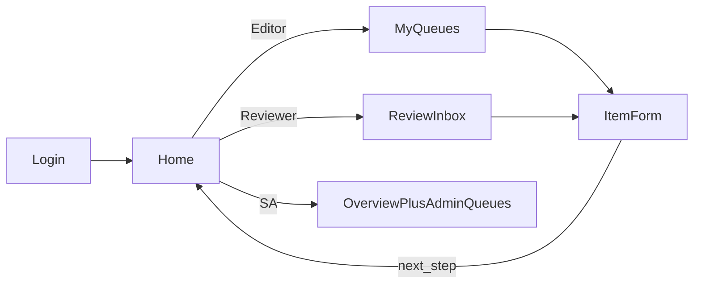

# PRD: CMS navigation & authoring UX / تجربة التنقل والتحرير في نظام إدارة المحتوى

| Field | Value |
|-------|--------|
| Status | **Approved** |
| Date | 2026-07-23 |
| Author | Product discovery (CRSIC 2026) |
| Owners | _(to be assigned — CRSIC + implementing team)_ |
| Related roadmap step | Step 4 — Internal CMS (post research groups/projects) |
| Supersedes | — |
| Related | [2026-07-19-internal-content-management.md](./2026-07-19-internal-content-management.md) (parent), [2026-07-22-cms-authoring-quality-pack.md](./2026-07-22-cms-authoring-quality-pack.md), [README.md §5.1](../../README.md#51-product-development-workflow-prd-first), [docs/WORKLOG.md](../WORKLOG.md) |
| Parent CMS status | Research groups/projects + authoring pack on `main` (PR #12) |
| Approved | 2026-07-23 — stakeholder completed PRD-prep plan approve gate |

**Document rule:** Locked decisions are unmarked. Open items labeled **Open question**. No implementation until Status = **Approved**.

**Ambiguity policy:** When unclear, stop and prompt the stakeholder. Never invent RBAC or workflow changes outside this PRD.

---

## 1. Problem

### Problem statement

The CRSIC CMS is functionally complete for draft → review → publish, but day-to-day use is hard:

1. **Nav scatter** — Flat top nav lists every content type as a peer (news…projects) plus media, notifications, and (for SA) admin links. Users hunt for “their” work.
2. **Round-trips** — Typical path is Dashboard queues → type list → item form → back to Dashboard or list. Too many goes and backs.
3. **Role confusion** — Editor / Reviewer / Super Admin see a similar chrome mix; it is not obvious what to do next.
4. **Heavy forms** — Long bilingual forms with little progressive disclosure; required vs optional (EN, SEO) compete for attention.

Stakeholder scoped pain as **all of the above** and asked for a **wide** fix: navigation IA, queues/home, forms, and empty/error/success states.

### Who feels it

| Actor | Pain |
|-------|------|
| Editor | Finds types slowly; form fatigue; loses place after submit |
| Reviewer | Inbox buried among type links; unclear “review next” |
| Super Admin | Admin tools interleaved with authoring; same round-trips |
| All | Empty queues and errors give little guidance |

---

## 2. Goals

1. A signed-in user lands on a **role-appropriate Home cockpit** and can see **what to do next** without scanning a long flat nav.
2. Content types are **grouped** (Centre content vs Research) and filtered to the user’s scopes — empty groups hidden.
3. After save / submit / approve / publish / unpublish, the user gets a **clear next step** (stay on item or return to Home) without mandatory detours through the type list.
4. Content forms follow one **AR-first, progressive-disclosure** pattern: identity → body → media → advanced (EN/SEO) → checklist → workflow actions.
5. Empty, error, and success states are **explicit** (one sentence + CTA / field errors / next-step banner).

### Non-goals

- Redesigning the public SPA or brand system beyond clearer CMS hierarchy.
- New content types.
- Email / SMTP notifications.
- Changing RBAC, org catalogs, or exclusivity rules (UI may only surface existing rules more clearly).
- Replacing hash routes or public JSON contracts.
- Slide-over editors as a requirement (nice-to-have only if cheap after M1–M2).
- Big-bang single release waiting for every pixel — delivery is **phased** (see §10).

---

## 3. Users & roles

| Role | Needs |
|------|--------|
| **Editor** | Home = my drafts / needs revision / recently published; **My content** (scoped types); Media; create/edit with simple forms; Notifications; Profile |
| **Reviewer** | Home = review inbox first (+ Away/delegation/post-review queues when relevant); reach items to review without hunting type lists; light Editors tools; Notifications; Profile |
| **Super Admin** | Same content cockpit as Reviewer, plus visually separated **Admin**: Users, Org scopes, Editors, Audit |

---

## 4. Requirements

### Must have

1. **Role-grouped chrome** — Primary nav as in §6; Admin block separated for SA; no Admin links between content types.
2. **Grouped content entry** — “Centre content” (news, event, publication, partner, alert) and “Research” (research_group, research_project) when the user has types in that group; hide empty groups.
3. **Home = cockpit** — Role-prioritised queues with counts; primary CTA (“Review next”, “Continue draft”, “Create…”).
4. **Preserve special queues** — Delegation proposals, needs post-review, emergency-related lists remain on Home for Reviewer/SA.
5. **Stable URLs** — Keep `/dashboard/news`, `/dashboard/research-groups`, etc.; reorganize chrome and Home first.
6. **Post-action routing** — After workflow actions, prefer Home or stay on item with next-step affordance; do not force type-list detour.
7. **Form structure** — Shared section order across content types; AR required block first; EN / SEO / advanced collapsed or secondary until opened.
8. **Checklist on submit** — Remains mandatory; clearer placement only.
9. **Authoring pack preserved** — Preview, rich body, SEO fields, EN status badge remain reachable (may sit under “More” / Advanced).
10. **Empty / error / success** — Empty queues: one sentence + CTA; forms: top summary + field errors; success: banner/toast with next step.
11. **i18n** — All new chrome strings in `cms/src/lib/i18n/labels.ts` (AR + EN).
12. **Responsive** — Nav overflow/collapse on small screens; forms single-column on narrow viewports.
13. **Phased delivery** inside this PRD: **M1** nav + Home; **M2** forms; **M3** empty/error/success polish + Home tips.

### Should have

1. Create from Home with org/type prefilled when the user has a single org and/or single type.
2. “Back” control that returns to Home or the type list (consistent CMS step), not an ambiguous browser back.
3. Badge counts on Home sections and Notifications only — not every content-type nav item.
4. Short in-app tip strip on Home for one release after M1 (dismissible).

### Nice to have

1. Sticky workflow action bar on long forms.
2. Slide-over create/edit without leaving the list (only if it does not delay M1–M2).

---

## 5. Content / data impact

- **No change** to public `data/*.json` shapes or `CONTENT_BASE_URL` contract ([data/CMS.md](../../data/CMS.md)).
- CMS-only UI / chrome / form layout. Publish pipeline and live payloads unchanged unless a bugfix is required for display.

---

## 6. UX notes

### Nav (target)

| Role | Primary | Secondary |
|------|---------|-----------|
| Editor | Home, My content (grouped), Media, Notifications, Profile | — |
| Reviewer | Home, (content via Home / My content if scoped), Editors (light), Notifications, Profile | Media if needed |
| Super Admin | Reviewer-like content chrome + **Admin** group: Users, Org scopes, Editors, Audit | — |

### Home cockpit

### Forms

- Sections: Identity → Body → Media → Advanced (EN, SEO, meta) → Checklist → Workflow actions.
- Research projects: group picker; sections order dibaja → questions → axes → duration → impacts (match public detail).
- Reuse existing `rich-body-editor`, `seo-fields`, workflow meta — consistent shell, not seven layouts.

### Milestones

| Milestone | Ships |
|-----------|--------|
| **M1** | Role-grouped nav; Home cockpit priority; Admin separation; stable URLs; post-action return to Home/item |
| **M2** | Progressive-disclosure forms for all current content types; checklist/advanced placement |
| **M3** | Empty/error/success states; dismissible Home tips; badge policy; responsive polish |

Each milestone merges to `main` only when smoke for that slice is green ([docs/qa/SMOKE-CMS.md](../qa/SMOKE-CMS.md) + relevant manual checks).

---

## 7. Technical notes

- Touch primarily: `cms-chrome.tsx`, `dashboard/page.tsx`, `labels.ts`, content `*-form.tsx` pages, shared form chrome components.
- Do **not** change `users.ts` exclusivity / org catalog rules unless a bug is found; UI hides empty groups only.
- Feature branch per milestone (e.g. `feature/cms-ux-m1-nav-home`) until stable; PRD remains source of truth.
- No new Nest/email services.

---

## 8. Success metrics

| Metric | Pass |
|--------|------|
| Editor with only research scopes | Sees Research group in nav; no empty Centre content group |
| Reviewer | Can start a review from Home in ≤2 clicks from login |
| After submit | User sees success + next step; not stranded on a blank list |
| Form | Required AR path completable without opening EN/SEO |
| Regression | Existing smoke (`db:smoke`, `db:smoke:research`) still pass after each milestone |
| Preview / SEO / EN | Still reachable on item forms after M2 |

---

## 9. Open questions

_None blocking._ Stakeholder may still veto milestones or tip-strip copy before Approve.

---

## 10. Decision log

| Date | Decision |
|------|----------|
| 2026-07-23 | Pain = all (nav + round-trips + role confusion + forms); scope = **Wide** in one PRD |
| 2026-07-23 | Delivery = **phased** M1 nav/Home → M2 forms → M3 polish (not big-bang) |
| 2026-07-23 | Keep existing dashboard URLs; reorganize chrome + Home first |
| 2026-07-23 | Home = cockpit; Admin visually separated; hide empty content groups |
| 2026-07-23 | Keep Reviewer/SA special queues (delegation, post-review) on Home |
| 2026-07-23 | AR-first progressive disclosure; checklist mandatory; authoring pack (preview/SEO/rich body/EN) preserved |
| 2026-07-23 | Out of scope: public SPA redesign, new types, email, RBAC rule changes, brand rethink |
| 2026-07-23 | Process: no implementation until this PRD Status = **Approved** |
| 2026-07-23 | **Approved** — stakeholder completed PRD-prep plan (approve gate); implementation may begin on feature branches per M1→M2→M3 |

---

## 11. Approval

**Approved 2026-07-23.** Implementation proceeds on feature branches per milestones M1 → M2 → M3; PRD remains source of truth.
